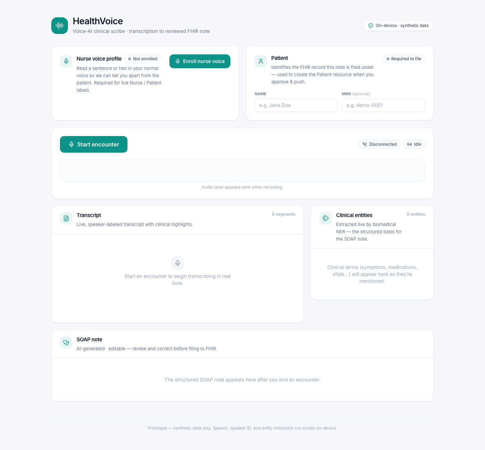

# HealthVoice

**A real-time voice-AI clinical scribe — from a nurse speaking to a clinician-reviewed FHIR note, running on-device.**



<p align="center">
  
  
  
  
  
  
</p>

HealthVoice listens to a clinical encounter and turns it, in near real time, into a
structured **SOAP note** that a clinician reviews, edits, signs, and files to a **FHIR**
server — with safety checks and a full audit trail. Speech recognition, speaker
identification, and medical entity extraction all run **locally on the machine**; only
the final note-structuring step calls a hosted LLM.

> **Build-in-public artifact.** This is a working prototype that reproduces the
> "Voice AI Assistant for Healthcare" system-design case study
> ([source](https://github.com/ombharatiya/ai-system-design-guide/blob/main/16-case-studies/13-voice-ai-healthcare.md))
> as a real, end-to-end system at single-Mac scale — not a mock-up. Every stage runs;
> the data is synthetic.

---

## The pipeline

```mermaid
flowchart LR
  Mic["Nurse + patient<br/>microphone audio"] --> VAD["Silero VAD<br/>endpointing"]
  VAD --> ASR["Hybrid Whisper ASR<br/>base.en draft + large-v3-turbo final"]
  ASR --> SPK["ECAPA voiceprint<br/>live Nurse / Patient labels"]
  SPK --> NER["Biomedical NER<br/>clinical entities"]
  NER --> SOAP["LLM SOAP note<br/>structured S/O/A/P"]
  SOAP --> SAFE["Deterministic safeguards<br/>safety · completeness · corrections"]
  SAFE --> REVIEW["Clinician review,<br/>edit + sign-off"]
  REVIEW --> FHIR[("HAPI FHIR R4<br/>Patient · Encounter · Composition · Provenance")]

  classDef local fill:#e6f5f3,stroke:#0d9488,color:#0f766e;
  classDef cloud fill:#fff7ed,stroke:#f59e0b,color:#b45309;
  class VAD,ASR,SPK,NER,SAFE local;
  class SOAP cloud;
```



| Stage | What it does | Model / tech | Runs |
|-------|--------------|--------------|------|
| **Endpointing** | Detects speech boundaries so silence never reaches the recognizer | [silero-vad](https://github.com/snakers4/silero-vad) | on-device |
| **Transcription** | Hybrid ASR: a fast draft for live partials + an accurate final per sentence | MLX Whisper `base.en` + `large-v3-turbo` | on-device |
| **Speaker ID** | Live Nurse / Patient labels from an enrolled voiceprint (+ optional refine pass) | ECAPA (speechbrain) · pyannote (optional) | on-device |
| **Medical NER** | Tags symptoms, conditions, meds, vitals, anatomy | `d4data/biomedical-ner-all` | on-device |
| **SOAP note** | Structures the labeled transcript into editable S/O/A/P + meds + review flags | OpenAI `gpt-5.5` (strict JSON schema) | hosted API |
| **Safeguards** | Safety-critical detection, completeness check, self-correction handling | deterministic (regex) | on-device |
| **Review → FHIR** | Clinician edits + signs; note filed as a FHIR transaction Bundle with Provenance | HAPI FHIR R4 | local server |

---

## Why it's built this way

- **On-device for the HIPAA story.** ASR, speaker ID, and NER run entirely on the
  machine — patient audio never leaves it. The **only** network egress is the SOAP
  note-structuring call to OpenAI (and that is swappable).
- **Hybrid ASR, because the case study's latency number assumes a datacenter GPU.**
  Whisper `large-v3-turbo` has a ~2 s fixed encoder cost per call on Apple Silicon, so
  true sub-500 ms streaming isn't possible locally. HealthVoice runs a fast `base.en`
  **draft** for live interim text and the accurate `large-v3-turbo` **final** once per
  sentence — audio capture is decoupled from transcription so the mic never blocks.
- **Deterministic safeguards, not an LLM judge.** Safety-critical detection,
  completeness, and self-correction handling are pure rule-based functions — no extra
  egress, no model nondeterminism on the parts that matter clinically.
- **Human-in-the-loop by design.** The AI produces a *draft*. Nothing is filed until a
  clinician reviews, edits, and signs it — and that sign-off is recorded.

### Clinical safeguards

| Safeguard | What it catches |
|-----------|-----------------|
| 🔴 **Safety-critical detector** | Self-harm / suicidal ideation, abuse/violence, mandatory-reporting triggers — surfaced as a blocking banner that must be acknowledged before filing |
| ✅ **Completeness check** | Extracted clinical entities that didn't make it into the note → flagged for verification |
| ↩ **Correction-pattern detection** | "Actually… / I mean… / scratch that" — the later, corrected statement is preferred |
| 📋 **Audit trail** | Clinician sign-off recorded as a FHIR `Provenance` resource + `Composition.attester` (legal) and an on-device JSONL log of who filed what and which fields were edited from the AI draft |

---

## Tech stack

- **Backend:** Python 3.12 · FastAPI + WebSocket · MLX Whisper · silero-vad · speechbrain
  ECAPA · pyannote.audio · HuggingFace Transformers · OpenAI · httpx
- **Frontend:** Next.js 14 (App Router) · React 18 · TypeScript · Tailwind CSS ·
  Web Audio API (`AudioWorklet`)
- **Interop:** FHIR R4 via a local HAPI FHIR server (Docker)

## Repository layout

```
health_voice/
├─ backend/          FastAPI inference service (VAD → ASR → speaker ID → NER → SOAP → FHIR)
│  ├─ app/
│  │  ├─ main.py         WebSocket + REST endpoints
│  │  ├─ config.py       env-driven configuration
│  │  └─ pipeline/       vad · asr · diarization · ner · soap · analysis · audit · fhir
│  ├─ docker-compose.yml local HAPI FHIR R4 server
│  └─ README.md          backend setup + WebSocket/REST protocol
└─ frontend/         Next.js clinical console (live transcript, entities, SOAP, FHIR)
   ├─ app/
   │  ├─ components/     TranscriptionConsole.tsx + ui.tsx (shadcn-style primitives)
   │  └─ ...
   └─ README.md          frontend setup + wire protocol
```

---

## Quick start

**Prerequisites:** macOS on Apple Silicon · [uv](https://docs.astral.sh/uv/) · Node 18+ ·
Docker (for the FHIR server) · an OpenAI API key (for the SOAP note) · *(optional)* a
Hugging Face token (for the pyannote diarization refine pass).

### 1 — Backend (inference service)

```bash
cd backend
cp .env.example .env          # add OPENAI_API_KEY (and optionally HF_TOKEN)
uv sync                       # creates .venv (py3.12) + installs deps
uv run uvicorn app.main:app --port 8000
```

First boot downloads the Whisper / NER / ECAPA weights and warms them (~1 min).
`GET http://localhost:8000/health` returns `{"ready": true}` when warm.

### 2 — FHIR server (Docker)

```bash
cd backend
docker compose up -d          # HAPI FHIR R4 at http://localhost:8080/fhir
```

### 3 — Frontend (clinical console)

```bash
cd frontend
npm install
npm run dev                   # http://localhost:3000
```

### 4 — Use it

1. **Enroll the nurse's voice** once (~10 s) so the system can tell Nurse from Patient.
2. Enter the **patient** name/MRN, click **Start encounter**, and speak.
3. Watch the transcript, speaker labels, and clinical entities build live.
4. Click **Finish** → an editable **SOAP note** is generated, with completeness and
   any safety alerts.
5. Review/edit, **sign** as the clinician, and **push to FHIR** — the created
   resources (including `Provenance`) are linked for inspection in the HAPI server.

---

## Status & roadmap

- [x] **Phase 1** — real-time on-device transcription (hybrid Whisper + VAD)
- [x] **Phase 2** — speaker diarization (live ECAPA voiceprint + optional pyannote refine)
- [x] **Phase 3** — medical NER (biomedical entity extraction)
- [x] **Phase 4** — SOAP note generation (structured LLM output)
- [x] **Phase 5** — clinician review → FHIR R4 push (HAPI)
- [x] **Phase 6** — clinical safeguards (safety / completeness / corrections / audit trail)
- [ ] Demo video + deep-dive write-up

---

## Disclaimer

This is a **prototype for educational and portfolio purposes only**. It is **not a
medical device** and must **not** be used for real clinical care or with real patient
data. All data shown is **synthetic**.

## Acknowledgements

System-design case study by
[ombharatiya/ai-system-design-guide](https://github.com/ombharatiya/ai-system-design-guide).
Built on open models and tools: OpenAI Whisper (MLX), silero-vad, speechbrain ECAPA,
pyannote.audio, `d4data/biomedical-ner-all`, HAPI FHIR, and OpenAI for note structuring.

## License

[MIT](LICENSE)
